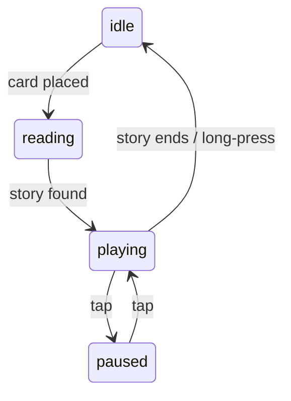

# Storyteller Box (Offline Edition)

> **A fully offline, NFC-triggered storytelling device for kids – featuring pre-recorded narration and background music.**

---

## Table of Contents

1. [Overview](#overview)
2. [How It Works](#how-it-works)
3. [Bill of Materials](#bill-of-materials)
4. [Software Stack](#software-stack)
5. [Repo Layout](#repo-layout)
6. [Quick Start](#quick-start)
7. [Adding New Stories](#adding-new-stories)
8. [Calm Time Logic](#calm-time-logic)
9. [Hardware Components](#hardware-components)
10. [LED & Button Feedback](#led--button-feedback)

---

## Overview

Storyteller Box is a small bedside companion that **tells pre-recorded Italian fairy tales** triggered by NFC cards. Children place an NFC-tagged card on the lid, and the box plays a corresponding story with matching background music. The device is **fully offline**, with all narration and music pre-loaded onto an SD card.

- **No internet required:** All stories and background music are pre-recorded and stored locally.
- **Simple controls:** A single illuminated button handles play, pause, and shutdown.
- **Calm time logic:** Automatically selects calm stories during bedtime hours.
- **Parent-friendly:** Easily add new stories and music by copying files to the SD card.

---

## How It Works



- **NFC**: MFRC522 reader notices a tag, sends UID to the pipeline.
- **Audio**: PCM5102 DAC → PAM8403 amp → 3 W speaker; headphones auto-mute the driver.
- **User controls**: illuminated button – tap to pause/play, hold 3 s to shut down.
- **Parent dashboard**: minimal Flask UI to add new cards & tweak settings.
- **NFC card tap:** Tap the NFC card on the reader. The LED will blink to confirm the card was read. You can remove the card immediately; the story will play automatically.
- **Interrupt:** If you tap a new card while a story is playing or paused, the current story will stop and the new one will start.
- **Busy:** If the system is loading or generating a story, wait for the LED to return to idle before tapping a new card.

---

## Bill of Materials

| Qty | Item                                                  | Notes                         |
| --- | ----------------------------------------------------- | ----------------------------- |
| 1   | **Raspberry Pi Zero 2 W**                             | 1 GHz quad-core, 512 MB RAM   |
| 1   | **MFRC522 NFC reader**                                | SPI, 13.56 MHz                |
| 1   | **Momentary push-button with built-in LED**           | LED wired to 5 V (always on)  |
| 1   | **PCM5102 I²S DAC**                                   | 24-bit / 96 kHz               |
| 1   | **PAM8403 stereo amp module**                         | Wired mono; jumper channels   |
| 1   | **3 W 4 Ω speaker**                                   | Ø 28–40 mm                    |
| 1   | **10 kΩ logarithmic potentiometer**                   | Passive volume knob           |
| 1   | **3.5 mm switched headphone jack**                    | Breaks speaker line on insert |
| 1   | **USB-C power bank (≥ 10 000 mAh)**                   | 8 h runtime target            |
| 1   | **Inline rocker switch**                              | Safe shutdown wiring          |
| 1   | **ABS enclosure 120 × 120 × 65 mm**                   | Opaque; drill/mill openings   |
| —   | Dupont wires, standoffs, screws, acrylic spacer, etc. |                               |

---

## Software Stack

- **Python 3.11** (matches Raspberry Pi OS Bookworm)
- **llama-cpp-python** with **TinyLlama-1.1 B Q4_K_M** (`models/`)
- **OpenAI TTS API** – Italian voice
- **Flask** + HTMX for the web dashboard
- **systemd** services: `reader.service`, `engine.service`, `dashboard.service`
- **Poetry** + **pre-commit** for dependency & lint hygiene
- **GitHub Actions** CI

---

## Repo Layout

```
storyteller-box/
├── models/                # TinyLlama .gguf, OpenAI TTS configs (git-ignored)
├── src/
│   ├── story_gen.py       # LLM wrapper
│   ├── tts.py             # OpenAI TTS helper
│   ├── hal.py             # UIDReader, Button + mocks + Pi impls
│   ├── box.py             # state machine
│   └── dashboard/         # Flask app (templates, static)
├── scripts/
│   ├── bootstrap_pi.sh    # one-shot setup
│   ├── install.sh         # venv & deps on Pi
│   └── run_local_demo.sh  # macOS smoke test
├── services/
│   ├── reader.service
│   ├── engine.service
│   └── dashboard.service
├── tests/
│   └── …                  # pytest suites
├── README.md              # ← you are here
└── pyproject.toml         # Poetry deps
```

---

## Quick Start

```bash
# 1. Flash & connect
#    — Raspberry Pi OS Lite 64-bit
#    — Enable SSH + Wi-Fi creds in imager
ssh pi@storybox.local

# 2. Bootstrap
curl -sSL https://raw.githubusercontent.com/you/storyteller-box/main/scripts/bootstrap_pi.sh | bash

# 3. Wire hardware following README pinout
# 4. Reboot and enjoy the first fairy tale!
```

---

## Adding New Stories

1. Add a new card JSON in both `stories/` (for TTS) and `storiesoffline/` (for offline).
2. For offline, generate and place the mp3 files in the correct `audio/` subfolder.
3. Update the `audio` field in the offline JSON to match the mp3 filename.

---

## Calm Time Logic

- **From 20:30 to 6:30:** Only stories with `tone: "calmo"` (or `"calm"`) are selected.
- **Other times:** Stories with `tone: "calmo"` are excluded from random selection.

---

## Hardware Components

- **Booting / Power Management**
  - ON/OFF USB switch (main power control)
- **NFC Reader**
  - MFRC522 or compatible module for card detection
- **Action Button with Integrated LED**
  - Single illuminated button (handles both user input and LED feedback)
- **Volume Knob**
  - Analog or digital potentiometer for volume adjustment
- **Amplifier & Jack**
  - Audio amplifier (e.g. PAM8403) and 3.5mm jack for speaker/headphones
- **Audio Output**
  - DAC (e.g. PCM5102) for high-quality audio playback

**Optional / Future:**
- Battery management (if portable)
- Wi-Fi or Bluetooth module (for updates or remote control)
- Parent dashboard display (OLED, LCD, etc.)

> All hardware interfaces should be abstracted in code for portability and testability.

---

## LED & Button Feedback

| Stato FSM      | LED integrato                        | Funzione tasto         | Note UX                                      |
| -------------- | ------------------------------------ | ---------------------- | -------------------------------------------- |
| BOOTING        | breathing lento (1 Hz, 10→100%)      | DISABLED               | “Sto accendendo”                             |
| IDLE           | LED spento                           | –                      | Pronta per una carta                         |
| CARD LETTA     | 2 lampeggi rapidi (100ms ON/OFF)     | –                      | Carta riconosciuta, pronta a caricare        |
| LOADING        | blink 4 Hz                           | DISABLED               | Caricamento/generazione storia/audio         |
| PLAYING        | breathing lento (40% luminosità)     | Tap = PAUSA            | “Sto raccontando”                            |
| PAUSED         | breathing medio (0.5 Hz)             | Tap = resume           | Pausa, respiro lento                         |
| LONG PRESS     | blink 2 Hz durante generazione       | DISABLED               | Nuova storia, debounce 2s                    |
| END            | 2 lampeggi lenti (200ms ON/800ms OFF)| –                      | Fine storia, pronta per nuova carta          |
| ERROR          | blink 8 Hz × 3s                      | Tap = reset            | Errore, richiede attenzione/adulto           |
